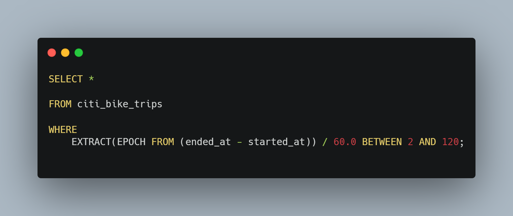
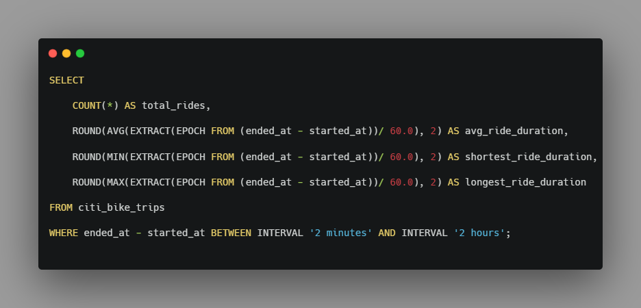
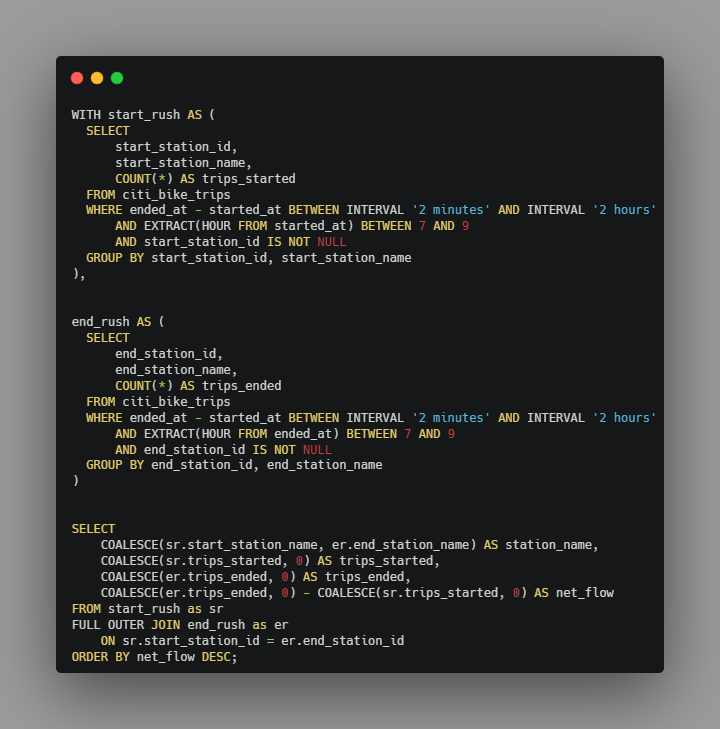
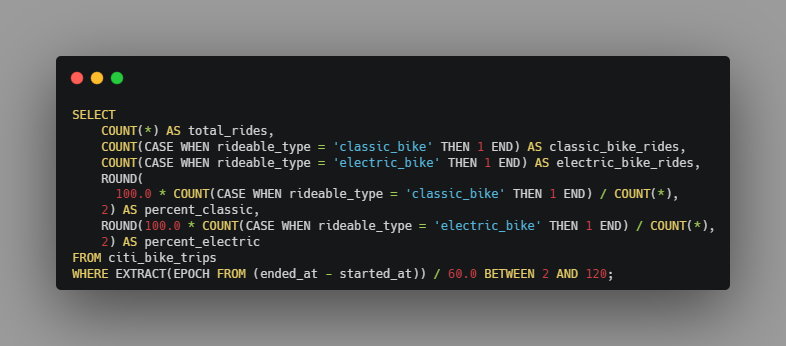
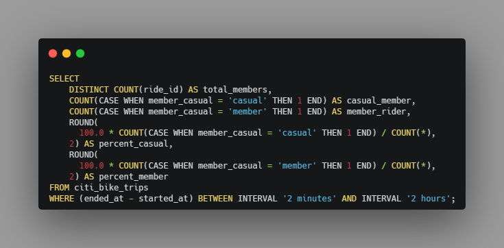
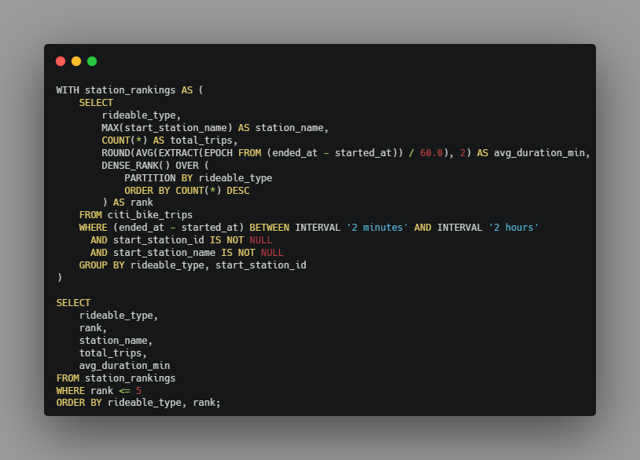
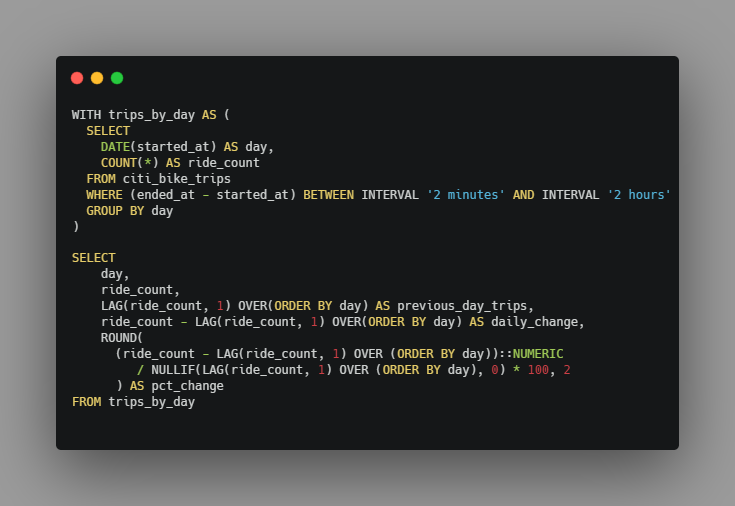
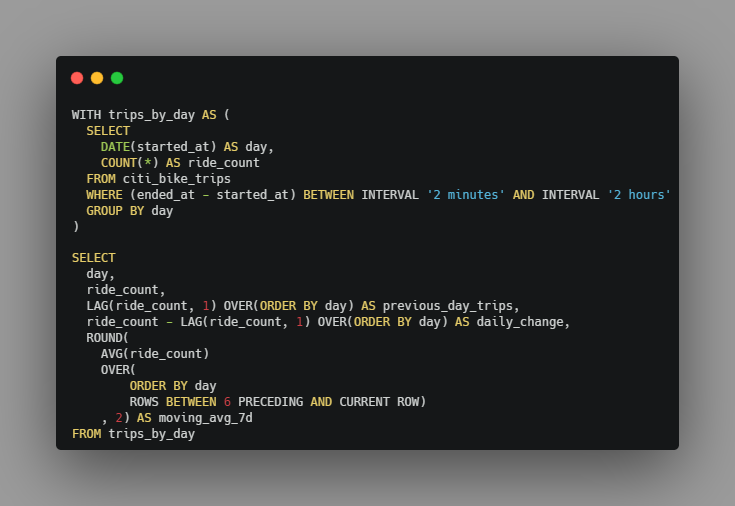
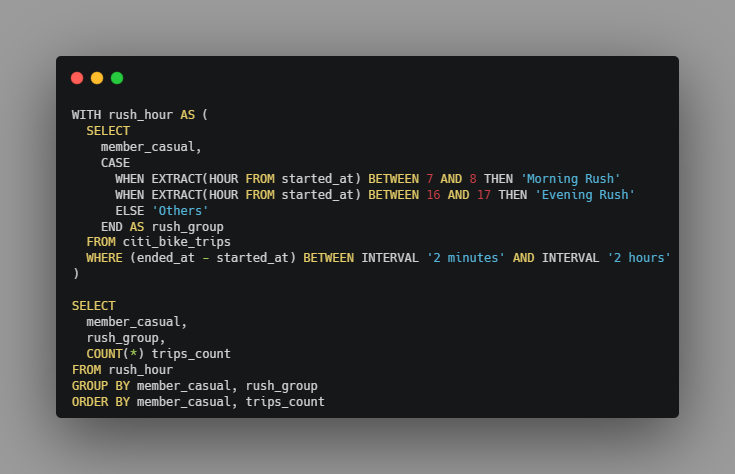

# Introduction
📊 This project looks at how people use Citi Bikes in New York City. It uses database tools to find peak riding times, popular stations, and bike choices.

I found the Citi Bike Dataset and decided to play with some analysis on it.  

## The Business Problem
I decided to simulate a problem from the perspective of the Head of Operated Markets -  Dominick Tribone. Yes he is real. He controls regional operations across multiple micro-mobility markets for Lyft, including the overarching strategy for major systems like Citi Bike.

> **Disclaimer:** This is a hypothetical exercise for portfolio purposes, not affiliated with Lyft or Citi Bike.

Failure for him is having stations empty with no bikes to satisfy customers. 

- **Specific problem:** In the morning, people ride bikes from home to work. Docks near homes get completely empty. Docks near offices get completely full.

- **The bad outcome:** If a dock is empty, riders walk away and Citi Bike loses money. If a dock is full, riders waste time looking for a spot or park e-bikes on the street. This makes riders quit their paid memberships and forces workers to drive vans around all day to fix the mess.

**Dominick Tribone** with the Operations managers in charge of day-to-day execution, now want to tackle this problem- they requested the analysis to be presented in the next end of the month meeting (April alone).

Data hails from: [Citi Bike Trip Histories](https://citibikenyc.com/system-data).

It includes useful details like bike types, ride start time and end time, check below for the rest🙂.

### They wanted answers to three main questions in this project:
* **Which bikes do people pick?** Do riders prefer electric bikes or classic bikes.
* **Who uses the bikes and when?** How many riders are members versus casual users. We also looked at what times of day they ride, like morning or evening rush hours.
* **Where are bikes needed most?** We looked for the busiest stations and peak riding days to help Citi Bike run better.

# Context Boundaries
We set logical limits. We choose what data we will look at and what data we will ignore. This kept our analysis small and clear.
1. Drop rides under 2 minutes - can be broken bikes and rider returned it minutes after. 
2. Drop rides over 120 minutes - can be Docking Malfunctions, Lost or Stolen Bikes, or Forgotten Returns (huge $1200 fine for this🙂).

# EDA Overview
1. Schema Check: A Look at column names and data types.
    | Column Name | Data Type | Is Nullable | Column Default |
    | --- | --- | --- | --- |
    | `ride_id` | character varying | NO | *NULL* |
    | `rideable_type` | character varying | YES | *NULL* |
    | `started_at` | timestamp without time zone | YES | *NULL* |
    | `ended_at` | timestamp without time zone | YES | *NULL* |
    | `start_station_name` | text | YES | *NULL* |
    | `start_station_id` | character varying | YES | *NULL* |
    | `end_station_name` | text | YES | *NULL* |
    | `end_station_id` | character varying | YES | *NULL* |
    | `start_lat` | numeric | YES | *NULL* |
    | `start_lng` | numeric | YES | *NULL* |
    | `end_lat` | numeric | YES | *NULL* |
    | `end_lng` | numeric | YES | *NULL* |
    | `member_casual` | character varying | YES | *NULL* |
2. Data Clean Check: Check missing values, bad dates, and short or long rides.

    **Missing Values**

    | Column Name | Missing Count |
    | :--- | :---: |
    | `start_station_name` | 1939 |
    | `start_station_id` | 1939 |
    | `start_lat` | 1939 |
    | `start_lng` | 1939 |
    | `end_station_name` | 9886 |
    | `end_lat` | 10473 |
    | `end_lng` | 10473 |
    | `end_station_id` | 10498 |

    **Short or Long Rides**

    | duration_category | trip_count | percentage | min_minutes | max_minutes | avg_minutes | median_minutes | p95_minutes | p99_minutes |
    | :--- | :---: | :---: | :---: | :---: | :---: | :---: | :---: | :---: |
    | `Short (1-2 min)` | 107475 | 2.78 | 1.00 | 2.00 | 1.58 | 1.61 | 1.97 | 1.99 |
    | `Normal (2-120 min)` | 3744745 | 97.00 | 2.00 | 119.99 | 12.51 | 9.23 | 32.81 | 55.13 |
    | `Long (2-24 hrs)` | 7385 | 0.19 | 120.00 | 1439.30 | 290.02 | 193.51 | 814.47 | 1262.14 |
    | `Very Long (> 24 hr)` | 766 | 0.02 | 1441.06 | 1500.92 | 1498.66 | 1499.89 | 1499.94 | 1499.95 |

    **Bad dates**
    >There were no bad dates

# Core Metrics Needed
Dominick needs these metrics to understand operations and prevent FAILURE:
1. **Volume & Time:** Total rides, average trip time, and total rides by hour of the day.

    

    | total_rides | avg_ride_duration | shortest_ride_duration | longest_ride_duration |
    | :---: | :---: | :---: | :---: |
    | 3744745 | 12.51 | 2.0 | 119.99 |

2. **Net Station Flow:** Finding stations that run out of bikes or fill up in the morning rush (7 AM to 10 AM) and for evening rush (4 PM TO 7PM).

       I found out that, unique start_station_id numbers 2237 and unique start_station_name numbers 2234. We solved it by grouping by id and using max station name

    

    ### 7AM TO 10AM Rush
    | station_name | trips_started | trips_ended | net_flow |
    | :--- | :---: | :---: | :---: |
    | 9 Ave & W 33 St | 1637 | 4353 | 2716 |
    | E 47 St & Park Ave | 932 | 2747 | 1815 |
    | Broadway & W 25 St | 914 | 2604 | 1690 |
    | Greenwich St & Hubert St | 284 | 1891 | 1607 |
    | Broadway & E 21 St | 0 | 1595 | 1595 |

    ### 4PM TO 7PM Rush
    | station_name | trips_started | trips_ended | net_flow |
    | :--- | :---: | :---: | :---: |
    | Broadway & E 21 St | 0 | 1095 | 1095 |
    | W 12 St & Hudson St | 0 | 810 | 810 |
    | Broadway & W 58 St | 0 | 725 | 725 |
    | 1 Ave & E 6 St | 756 | 1352 | 596 |
    | Allen St & Hester St | 0 | 510 | 510 |

       Look at Broadway & E 21 St, it has 0 starts in both morning and evening rush hours. People ride here to go home at night. Riders do not start rides here during that time.
3. **Fleet Load:** We want to see how much people use each bike type.

    
    
        Classic bikes: 1,016,232 rides (27.14%)

        Electric bikes: 2,728,513 rides (72.86%)

        Electric bikes win by a lot!

4. **User Behavior:** Total rides and average trip duration split by user type (member vs. casual).

    

        Casual Rides: 603,849 (16.13%)

        Member Rides: 3,140,896 (83.87%)

        Members take most of the trips!

# Deeper EDA & Advanced Analytics
1. Top 5 Start Stations by Bike Type

    

### Classic Bikes
| rank | station_name | total_trips | avg_duration_min |
| :---: | :--- | :---: | :---: |
| 1 | W 21 St & 6 Ave | 4711 | 10.01 |
| 2 | Pier 61 at Chelsea Piers | 4165 | 14.55 |
| 3 | Lafayette St & E 8 St | 3741 | 10.15 |
| 4 | E 17 St & Broadway | 3403 | 10.97 |
| 5 | 8 Ave & W 16 St | 3340 | 9.36 |

### Electric Bikes
| rank | station_name | total_trips | avg_duration_min |
| :---: | :--- | :---: | :---: |
| 1 | W 21 St & 6 Ave | 9627 | 9.73 |
| 2 | Pier 61 at Chelsea Piers | 9206 | 12.40 |
| 3 | 9 Ave & W 33 St | 8801 | 11.26 |
| 4 | W 31 St & 7 Ave | 8584 | 10.79 |
| 5 | 7 Ave & Central Park So... | 8114 | 22.22 |

        Result
        1. W 21 St & 6 Ave is number 1 for both bike types.
        2. People ride electric bikes way more times than classic bikes.
        3. 7 Ave & Central Park South has very long rides. Rides there take 22 minutes on average.

2. **Daily trip trends**

    

    | day | ride_count | previous_day_trips | daily_change | pct_change |
    | :--- | :---: | :---: | :---: | :---: |
    | 2026-04-01 | 141453 | *null* | *null* | *null* |
    | 2026-04-02 | 87806 | 141453 | -53647 | -37.93 |
    | 2026-04-03 | 118946 | 87806 | 31140 | 35.46 |
    | 2026-04-04 | 120290 | 118946 | 1344 | 1.13 |
    | 2026-04-05 | 50307 | 120290 | -69983 | -58.18 |

    >First day has no past day. So it shows empty, April 2: Rides drop by 37.93%, April 3: Rides go up by 35.46% and April 5: Big drop! Rides fall by 58.18%. Bad weather could cause this.

3. **Bonus: 7-day moving average - To smooth out daily trip trends**

     

    | day | ride_count | previous_day_trips | daily_change | moving_avg_7d |
    | :--- | :---: | :---: | :---: | :---: |
    | 2026-04-01 | 141453 | *null* | *null* | 141453.00 |
    | 2026-04-02 | 87806 | 141453 | -53647 | 114629.50 |
    | 2026-04-03 | 118946 | 87806 | 31140 | 116068.33 |
    | 2026-04-04 | 120290 | 118946 | 1344 | 117123.75 |
    | 2026-04-05 | 50307 | 120290 | -69983 | 103760.40 |
    | 2026-04-06 | 106526 | 50307 | 56219 | 104221.33 |
    | 2026-04-07 | 107087 | 106526 | 561 | 104630.71 |

4. **User Type Breakdown by Rush Hour**

| member_casual | rush_group | trips_count |
| :--- | :--- | :---: |
| casual | Morning Ru... | 37410 |
| casual | Evening Rush | 106367 |
| casual | Others | 460072 |

| member_casual | rush_group | trips_count |
| :--- | :--- | :---: |
| member | Morning Ru... | 373812 |
| member | Evening Rush | 544666 |
| member | Others | 2222418 |

>    Members ride a lot in the morning. They have over 370,000 trips. Casual riders     only have 37,000. That is ten times more!

>    Evening is busy for everyone. Members take over 540,000 trips. Casual riders take over 100,000 trips.

# So, What Did We See?
### Point 1: Rider Habit
The evening rush has way more rides than the morning rush. The **"Others"** block is also huge, which shows that people use bikes all day long, not just to go to work.

---
### Point 2: Fleet & Station Trend
* **Electric bikes win:** 72.86% of all trips used electric bikes. People choose electric bikes way more than classic bikes.

* **Top stations:** A few main stations handle most of the start and end trips.

# Simple Business Advice
1.  Charge and place more electric bikes near high-flow stations before the evening rush.
2. Casual riders spike in the evening and "Other" hours. Offer them a special discount or perk to switch to a membership.
3. Put more bike docks at top evening stations so bikes do not pile up.

# Tools I Used
For the deep dive, I used the power of several key tools:
- **SQL:** The backbone of my analysis, allowing me to query the database and unearth critical insights.
- **PostgreSQL:** The chosen database management system, ideal for handling the job posting data.
- **Visual Studio Code:** My go-to for database management and executing SQL queries.
- **Git & GitHub:** Essential for version control and sharing my SQL scripts and analysis, ensuring collaboration and project tracking.

# Citi Bike Usage Analysis

> **Disclaimer:** This is a hypothetical exercise for portfolio purposes, not affiliated with Lyft or Citi Bike.